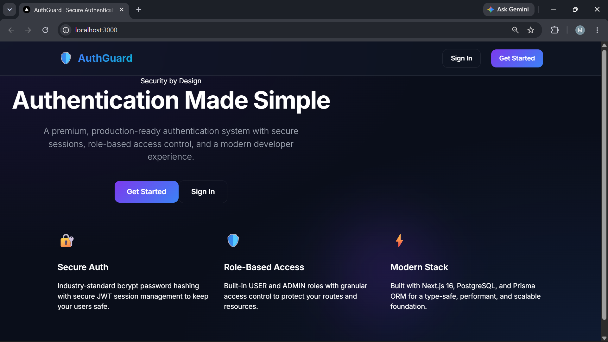
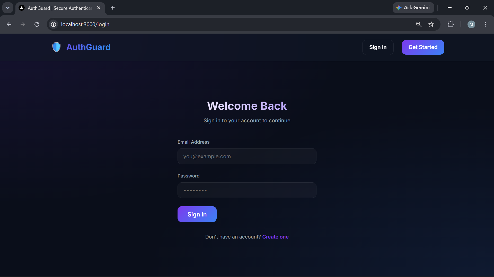
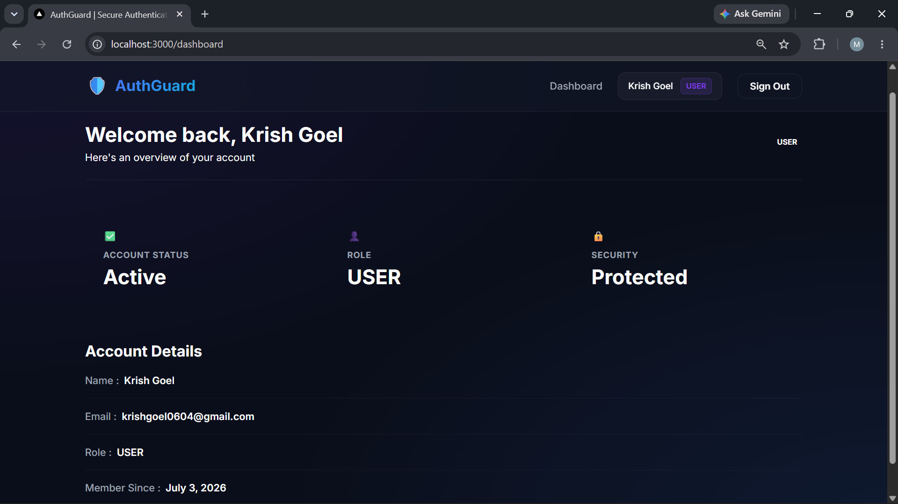
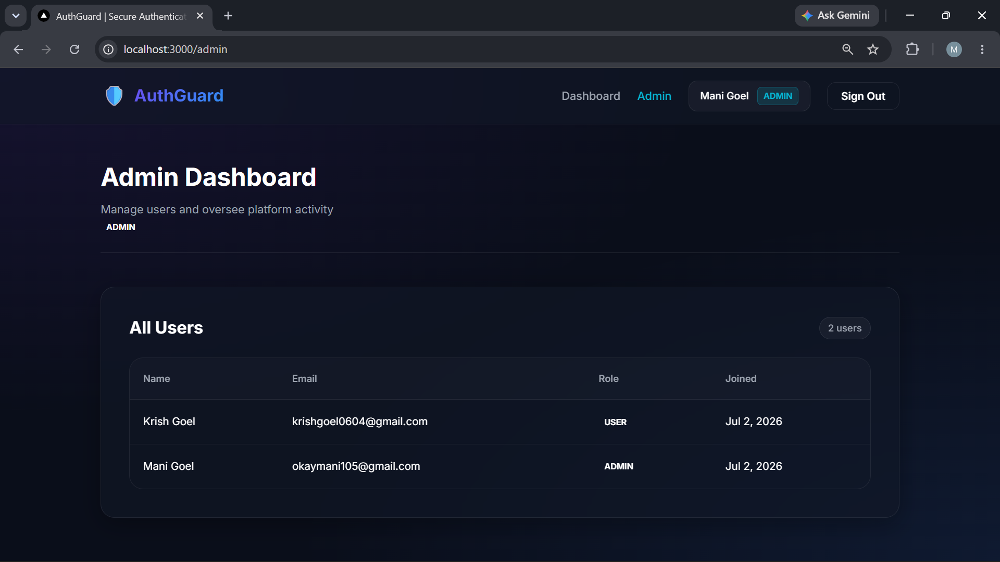

# 🔐 AuthGuard – Secure User Authentication System

Task-01 submission for my **Full Stack Development Internship** at **Prodigy InfoTech**.

AuthGuard is a full-stack authentication system built with **Next.js 16**, **React 19**, **TypeScript**, **Prisma ORM**, and **PostgreSQL**. It provides secure user registration, authentication, protected routes, and role-based authorization using modern web development practices.

---

## 📌 Project Overview

This project demonstrates the implementation of a secure authentication system where users can:

- Register a new account
- Log in securely
- Access protected routes after authentication
- Experience role-based authorization (User/Admin)
- Manage authenticated sessions securely

The application follows modern authentication practices using **Auth.js (NextAuth)**, **Prisma ORM**, and **PostgreSQL**.

---

## ✨ Features

- 🔐 User Registration
- 🔑 Secure Login
- 🛡️ Protected Routes
- 👥 Role-Based Access Control (Admin/User)
- 📊 Admin Dashboard
- 🔒 Password Hashing using bcryptjs
- 🔄 Secure Session Management using Auth.js (NextAuth)
- 🗄️ PostgreSQL Database Integration
- ⚡ Prisma ORM
- ✅ Form Validation using Zod
- 📱 Responsive User Interface

---

## 🔄 Authentication Flow

- User Registration
- Password Hashing with bcryptjs
- User Login using Auth.js
- Session Creation
- Protected Route Authorization
- Role-Based Access (User/Admin)

---

## 🛠️ Tech Stack

| Layer | Technology |
|--------|------------|
| Framework | Next.js 16 |
| UI Library | React 19 |
| Language | TypeScript |
| Authentication | Auth.js (NextAuth) |
| Database | PostgreSQL |
| ORM | Prisma ORM |
| Password Hashing | bcryptjs |
| Validation | Zod |
| Linting | ESLint |

---

## 📸 Screenshots

### 🏠 Landing Page



---

### 📝 Registration Page



---

### 📊 User Dashboard



---

### 👨‍💼 Admin Dashboard



---## ⚙️ Installation

Clone the repository:

```bash
git clone https://github.com/realmani-10/PRODIGY_FS_01.git
```

Navigate to the project directory:

```bash
cd PRODIGY_FS_01
```

Install dependencies:

```bash
npm install
```

Generate the Prisma Client:

```bash
npx prisma generate
```

Run database migrations:

```bash
npx prisma migrate dev
```

Create a `.env` file in the project root and configure the following environment variables:

```env
DATABASE_URL=
NEXTAUTH_SECRET=
NEXTAUTH_URL=
```

Start the development server:

```bash
npm run dev
```

Open your browser and visit:

```
http://localhost:3000
```

---

## 📚 Learning Outcomes

Through this project, I gained practical experience with:

- Authentication & Authorization
- Secure Password Hashing
- Session Management
- Protected Routes
- Role-Based Access Control
- Prisma ORM
- PostgreSQL Integration
- Form Validation with Zod
- Full Stack Development using Next.js
- TypeScript Best Practices

---

## 🚀 Future Enhancements

- Forgot Password functionality
- Email Verification
- User Profile Management
- Multi-Factor Authentication (MFA)
- OAuth Login (Google/GitHub)
- User Activity Logs

---

## 👨‍💻 Internship Details

**Organization:** Prodigy InfoTech

**Internship Role:** Full Stack Developer Intern

**Task:** Task-01 — Secure User Authentication

---

## 📄 License

This project was developed as part of my internship assignment at **Prodigy InfoTech** and is intended for educational and learning purposes.
### Landing Page

*(Add screenshot here)*

### Registration

*(Add screenshot here)*

### Dashboard

*(Add screenshot here)*

### Admin Panel

*(Add screenshot here)*

---

## ⚙️ Installation

```bash
git clone https://github.com/realmani-10/PRODIGY_FS_01.git

cd PRODIGY_FS_01

npm install

npm run dev
```

Create a `.env` file with:

```env
DATABASE_URL=
NEXTAUTH_SECRET=
NEXTAUTH_URL=
```

Run:

```bash
npx prisma migrate dev
```

---

## 📚 Learning Outcomes

During this task, I gained practical experience with:

- Authentication & Authorization
- NextAuth
- Prisma ORM
- PostgreSQL
- Secure Password Hashing
- Protected Routes
- TypeScript
- Modern Full Stack Development

---

## 👨‍💻 Internship

**Organization:** Prodigy InfoTech

**Task:** Task-01 — Secure User Authentication
